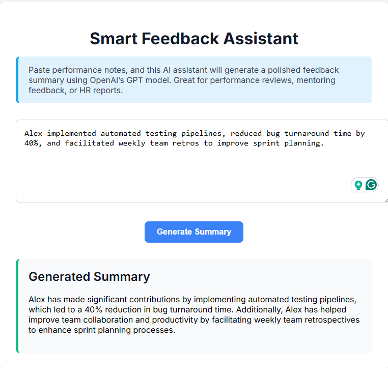

# Smart Feedback Assistant

A simple AI-powered web app to generate polished performance feedback summaries from raw notes using OpenAI’s GPT model. Great for HR, mentorship, or performance reviews.

---

## ✨ Features

- Paste raw feedback text
- Generate polished summaries via OpenAI API
- Stores history in `localStorage`
- Clean React UI with summary display
- Backend powered by FastAPI + PostgreSQL

---

## 🖼️ Screenshot



---

## 🛠️ Tech Stack

**Frontend**
- React (Create React App)
- CSS (vanilla)

**Backend**
- FastAPI (Python)
- OpenAI API
- PostgreSQL (via SQLAlchemy)

---

## 🚀 Getting Started

### Clone + Install
```bash
git clone https://github.com/moeaoun1/smart-feedback-frontend.git
cd smart-feedback-frontend
npm install
npm start
